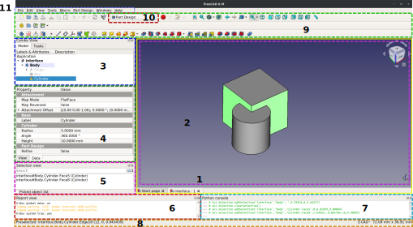

# Midtfyns Seniorværksted FreeCad Kursus

FreeCad Kursus hos Midtfyns Seniorværksted

## Forord  

Dette Repo er lavet for deltager i FreeCad 3D kursus hos Midtfyns Seniorværksted i Ringe, sådan deltager kan finde opgaverne når de er kommet hjem fra kursus og vil arbejde videre.

## Nyttige Link

* [FreeCAD](https://www.freecadweb.org/)
  * [Download](https://www.freecadweb.org/downloads.php)
  * [Documentation index](https://wiki.freecad.org/)
  * [Getting started](https://wiki.freecad.org/Getting_started)
  * [The FreeCAD manual](https://wiki.freecad.org/Manual)
* FreeCad Tutorial
  * [MangoJelly Solutions](https://www.youtube.com/c/MangoJellySolutions/playlists)
    * [FreeCAD 0.20 For Beginners](https://www.youtube.com/playlist?list=PLWuyJLVUNtc0UszswD0oD5q4VeWTrK7JC)

## FreeCAD's interface

Applikationens hovedvindue kan groft opdeles i 11 sektioner:

1. Hovedvisningsområdet, som kan indeholde forskellige faneblade
2. 3D-visningen, normalt indlejret i hovedvisningsområdet
3. Den øverste del af kombinationsvisningen, som inkluderer trævisningen og opgavepanelet
4. Den nederste del af kombinationsvisningen, som inkluderer egenskabseditoren
5. Valgvisningen
6. Rapportvisningen
7. Python-konsollen
8. Statuslinjen
9. Værktøjslinjeområdet, se følgende oplysninger på værktøjslinjerne
10. Workbench-vælgeren, som i sig selv er en værktøjslinje
11. Standardmenuen

SE den fulde vejledning her: [FreeCAD Interface](https://wiki.freecad.org/Interface)

## Preferences settings  

Der er indstillinger i FreeCad der kan være smarte at tilpasse, Preferences finder I Edit menuen, Klik Edit -> Preferences  

* General
  * General
    * Size of toolbar icons: **Medium (24px)**
    * Tree view mode: **Combo View**
    * Auto load module after start up: **Part Design**
  * Unit
    * Unit system: **Standard (mm/kg/s/degree)**
    * number af decimals: **2**
* Display
  * 3d View
    * Marker size: **15px**
  * Navigation
    * 3D Navigation: **Blender**
    * 
* Part Design
  * General
    * Automatically check model after boolean operation: **Checked**
    * Automatically refine model after boolean operation: **Checked**
    * Automatically refine model after skech-based operation: **Checked**
* Sketcher
  * General
    * Auto remove redundants: **Checked**

## PartDesign Workbench & Sketcher Workbench

I opgaverne som følger i dette afsnit skal vi bruge PartDesign & Sketcher Workbench, du kan se mere om disse værktøjer her:

* [PartDesign Workbench](https://wiki.freecad.org/PartDesign_Workbench)
* [Sketcher Workbench](https://wiki.freecad.org/Sketcher_Workbench)

### Tutorials

* [Oprettelse af en simpel del med PartDesign](https://wiki.freecad.org/Creating_a_simple_part_with_PartDesign)
* [Grundlæggende deldesigntutorial](https://wiki.freecad.org/Basic_Part_Design_Tutorial)

### Opgave 001

I opgave 001 skal vi tegne et køkken skab, i skabet skal vi tegne 1 Side_Plade, 1 Bund/Top_Plade, 1 bagbklædning og en Hylde.  
I side pladen skal vi lave huller for hylde bærer, ved hjælp af værktøjet LinearPattern.  
[Se Opgaven her!](./Opgaver/001_PartDesign/001_PartDesign.md)

I denne opgave skal vi arbejde med følgende tools:

* [   Standardmenuen er sammensat af 7 undermenuer. Hver undermenu har en dedikeret side. Bare klik på et af navnene nedenfor.](https://wiki.freecadweb.org/Std_Base)
  * [Std File Menu](https://wiki.freecadweb.org/Std_File_Menu)
    * [ Std New: Som opretter et nyt tomt dokument og gør det til det aktive dokument.](https://wiki.freecadweb.org/Std_New)
    * [ Std Save: Som gemmer det aktive dokument.](https://wiki.freecadweb.org/Std_Save)
    * [ Std CloseActiveWindow: Som lukker det aktive vindue. For at lukke et dokument skal alle dets vinduer være lukkede.](https://wiki.freecadweb.org/Std_CloseActiveWindow)
    * [ Std CloseAllWindows: Som lukker alle vinduer og lukker derved alle dokumenter.](https://wiki.freecadweb.org/Std_CloseAllWindows)
* [ PartDesign Workbench](https://wiki.freecadweb.org/PartDesign_Workbench)
  * Part Design Helper tools
    * [ Create body: opretter et Body-objekt i det aktive dokument og gør det aktivt.](https://wiki.freecadweb.org/PartDesign_Body)
    * [ Opret skitse: opretter en ny skitse på et valgt ansigt eller et valgt plan.](https://wiki.freecadweb.org/PartDesign_NewSketch)
    * [ Denne kommando giver dig mulighed for at redigere en eksisterende skitse. Det åbner Sketcher-dialogen.](https://wiki.freecadweb.org/Sketcher_EditSketch)
  * Part Design Modeling tools
    * [ PartDesign Plane.svg Opret et datumplan: opretter et datumplan i den aktive krop.](https://wiki.freecadweb.org/PartDesign_Plane)
  * Additive tools
    * [ Pad: Ekstruderer et solidt materiale fra en valgt skitse.](https://wiki.freecadweb.org/PartDesign_Pad)
  * Subtractive tools
    * [ Pocket: opretter en lomme ud fra en valgt skitse.](https://wiki.freecadweb.org/PartDesign_Pocket)
  * Transformation tools
    * [ Mirrored: spejler en eller flere funktioner.](https://wiki.freecadweb.org/PartDesign_Mirrored)
    * [ Lineært mønster: opretter et lineært mønster af en eller flere funktioner.](https://wiki.freecadweb.org/PartDesign_LinearPattern)
